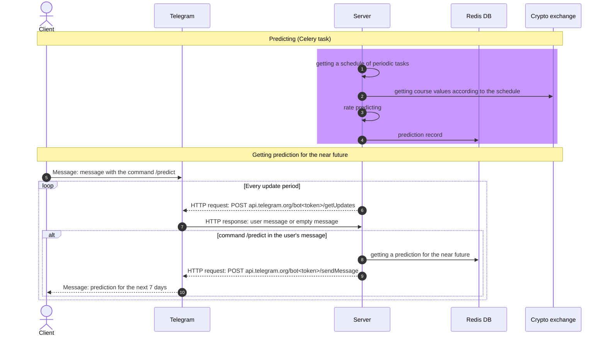

# UML schema
## Mermaid

```mermaid
sequenceDiagram
    autonumber
    actor client as Client
    participant telegram as Telegram
    participant server as Server
    participant database as Redis DB
    participant crypto_exchange as Crypto exchange
    
    Note over client, crypto_exchange: Predicting (Celery task)
    rect rgb(200, 150, 255)
    server ->> server : getting a schedule of periodic tasks
    server ->> crypto_exchange : getting course values according to the schedule
    server ->> server : rate predicting
    server ->> database : prediction record
    end
    
    Note over client, crypto_exchange: Getting prediction for the near future
    client ->> telegram : Message: message with the command /predict
    loop Every update period
        server -->> telegram : HTTP request: POST api.telegram.org/bot<token>/getUpdates
        telegram ->> server : HTTP response: user message or empty message
        alt command /predict in the user's message 
            server ->> database : getting a prediction for the near future
            server -->> telegram : HTTP request: POST api.telegram.org/bot<token>/sendMessage
            telegram -->> client : Message: prediction for the next 7 days
        end
    end
```
