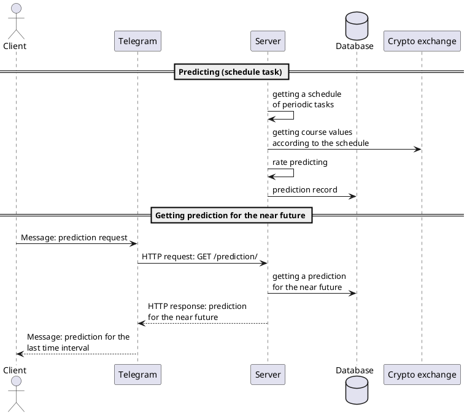
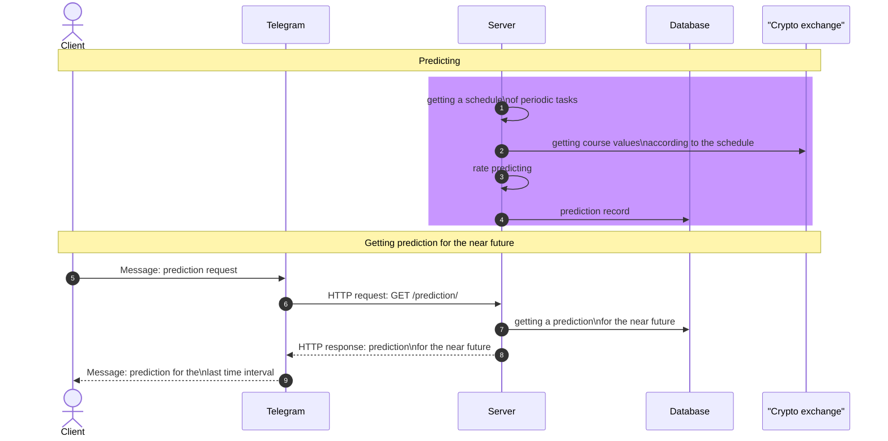

```plantuml
@startuml
actor Client as client
participant Telegram as telegram
participant Server as server
database Database as database
participant "Crypto exchange" as crypto_exchange

== Predicting (schedule task) ==
server -> server : getting a schedule\nof periodic tasks
server -> crypto_exchange : getting course values\naccording to the schedule
server -> server : rate predicting
server -> database : prediction record

== Getting prediction for the near future ==
client -> telegram : Message: prediction request
telegram -> server : HTTP request: GET /prediction/
server -> "database" : getting a prediction\nfor the near future
server --> telegram : HTTP response: prediction\nfor the near future
telegram --> client : Message: prediction for the\nlast time interval
@enduml
```

```mermaid
sequenceDiagram
    autonumber
    actor client as Client
    participant telegram as Telegram
    participant server as Server
    participant database as Database
    participant crypto_exchange as "Crypto exchange"
    
    Note over client, crypto_exchange: Predicting
    rect rgb(200, 150, 255)
    server ->> server : getting a schedule\nof periodic tasks
    server ->> crypto_exchange : getting course values\naccording to the schedule
    server ->> server : rate predicting
    server ->> database : prediction record
    end
    
    Note over client, crypto_exchange: Getting prediction for the near future
    client ->> telegram : Message: prediction request
    telegram ->> server : HTTP request: GET /prediction/
    server ->> database : getting a prediction\nfor the near future
    server -->> telegram : HTTP response: prediction\nfor the near future
    telegram -->> client : Message: prediction for the\nlast time interval
```