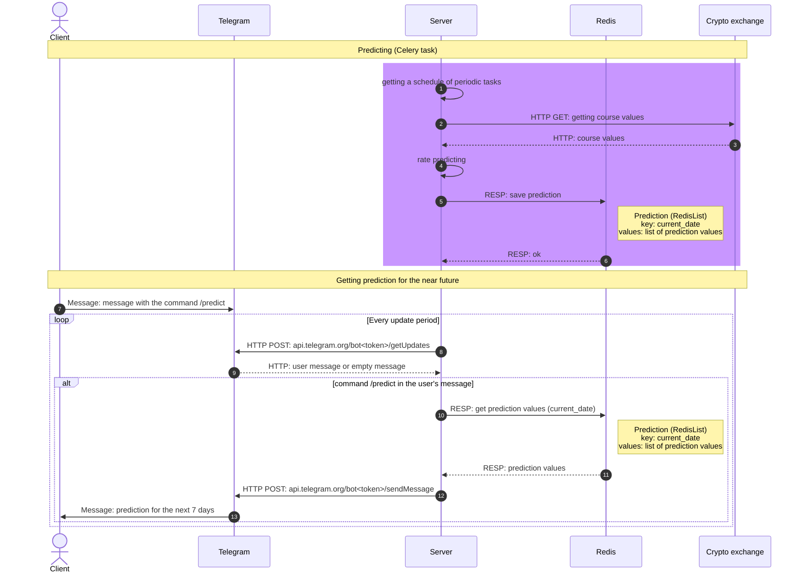

# UML schema

```mermaid
sequenceDiagram
    autonumber
    actor client as Client
    participant telegram as Telegram
    participant server as Server
    participant database as Redis
    participant crypto_exchange as Crypto exchange
    
    Note over client, crypto_exchange: Predicting (Celery task)
    rect rgb(200, 150, 255)
    server ->> server : getting a schedule of periodic tasks
    server ->> crypto_exchange : HTTP GET: getting course values
    crypto_exchange -->> server : HTTP: course values
    server ->> server : rate predicting
    server ->> database : RESP: save prediction
    Note right of database: Prediction (RedisList)<br/>key: current_date<br/>values: list of prediction values
    database -->> server : RESP: ok
    end
    
    Note over client, crypto_exchange: Getting prediction for the near future
    client ->> telegram : Message: message with the command /predict
    loop Every update period
        server ->> telegram : HTTP POST: api.telegram.org/bot<token>/getUpdates
        telegram -->> server : HTTP: user message or empty message
        alt command /predict in the user's message 
            server ->> database : RESP: get prediction values (current_date)
            Note right of database: Prediction (RedisList)<br/>key: current_date<br/>values: list of prediction values
            database -->> server : RESP: prediction values
            server ->> telegram : HTTP POST: api.telegram.org/bot<token>/sendMessage
            telegram ->> client : Message: prediction for the next 7 days
        end
    end
```
